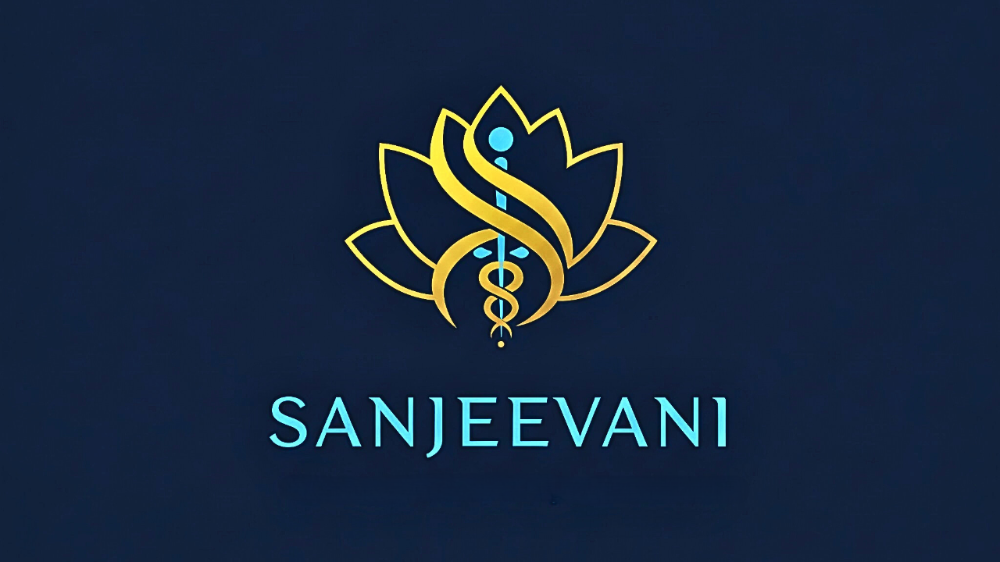
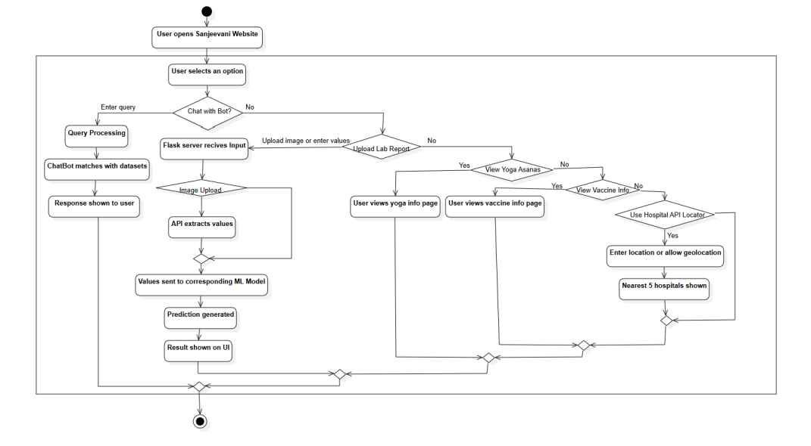
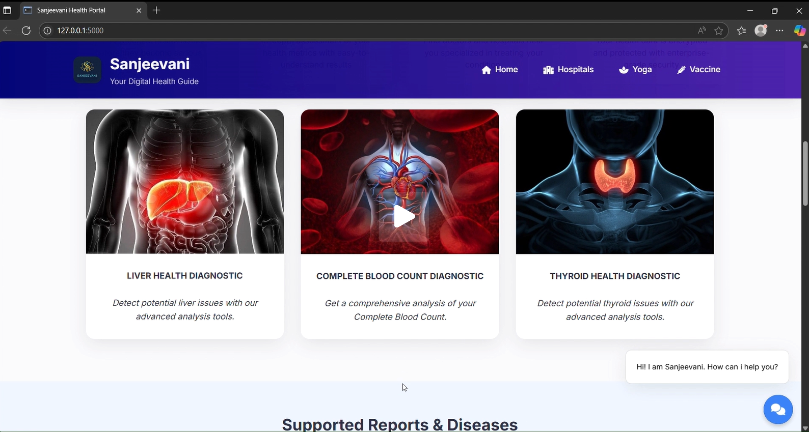

# 🌿 Sanjeevani – AI & ML Powered Health Companion

**Sanjeevani** is an advanced health-tech platform designed to bridge the gap between complex medical data and patient understanding. It leverages **Machine Learning** to interpret lab reports and **Conversational AI** to provide multilingual health guidance.


<p align="center">
  
</p> 

## 📌 Overview
Accessing timely and credible healthcare information is a major challenge due to geographic or financial barriers. Sanjeevani serves as a digital first point of interaction, helping users make educated decisions before visiting a physician.

### ✨ Key Features
* **ML-Powered Disease Prediction:** Automated analysis of **CBC**, **Thyroid**, and **Liver** reports using trained models to identify potential health risks.
* **Multilingual AI Chatbot:** A conversational assistant that understands symptoms in regional languages and suggests treatments or next steps.
* **Nearby Health Services:** Uses geolocation to find the five nearest hospitals, diagnostic centers, and pharmacies.
* **Holistic Wellness:** Provides curated **Yoga Veda** asanas for physical health and **ImmunoShield** for vaccination awareness.
* **Educational Integration:** Recommends verified medical videos from professional sources to enhance user health literacy.

## 🛠️ Tech Stack
* **Frontend:** HTML5, CSS3, JavaScript.
* **Backend:** Flask (Python).
* **Machine Learning:** Scikit-learn, Pandas, NumPy, Joblib.
* **Core Models:** Random Forest Classifier & Tuned LightGBM.


## 📊 Machine Learning Performance

<p align="center">
  
</p> 
<div align="center">

| Model | Target Disease | Algorithm | Performance |
| :--- | :--- | :--- | :--- |
| **CBC** | Bacterial Infection / Anemia | Random Forest | **97.89% Accuracy** |
| **Thyroid** | Thyroid Profile Issues | Random Forest | **98.62% Accuracy** |
| **Liver** | Liver Function/Damage | Tuned LightGBM | **75.17% Accuracy** |

</div>


## 🔄 System Architecture
The system follows a modular architecture:
1. **User Input:** Lab report upload (PDF/JPG) or manual value entry.
2. **Processing:** Flask backend parses data and extracts key medical parameters.
3. **Inference:** Data is fed into trained ML models to generate predictions.
4. **Action:** Results are displayed on the UI and supported by Chatbot recommendations.

<p align="center">
  
</p> 


## ⚙️ Setup Instructions

### 1️⃣ Environment Setup
* Install Python 3.10+
* Install dependencies:
    ```bash
    pip install flask pandas scikit-learn joblib lightgbm python-dotenv
    ```

### 2️⃣ API Configuration
* Create a `.env` file in the root directory.
* Add your Groq API key:
    ```text
    GROQ_API_KEY=your_key_here
    ```

### 3️⃣ Run the Application
```bash
python app.py
```

## 🎥 Demo Video  

<div align="center">
<a  href="https://drive.google.com/file/d/1BejL-r2VeRDxWu_yu2SfmlcyVauGGJzg/view?usp=sharing">
  
</a>
</div>

👨‍💻 Authors

Pallikonda Rakshan – [Linkedin](https://www.linkedin.com/in/rakshan-pallikonda/)
